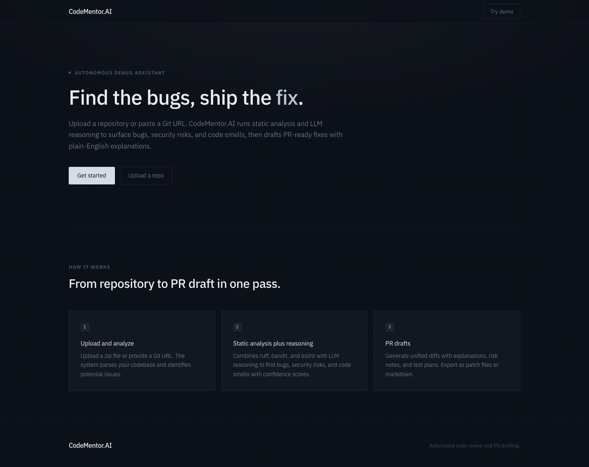
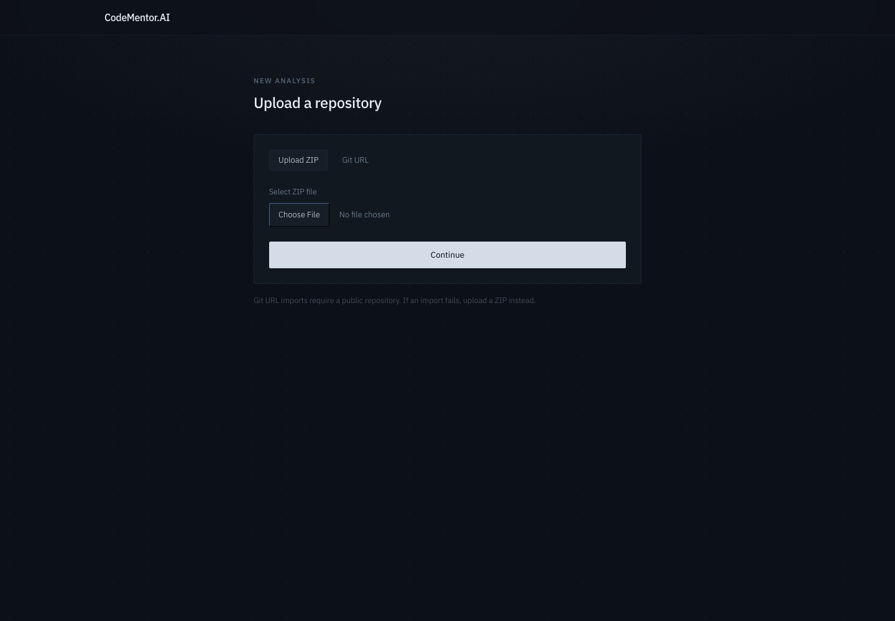
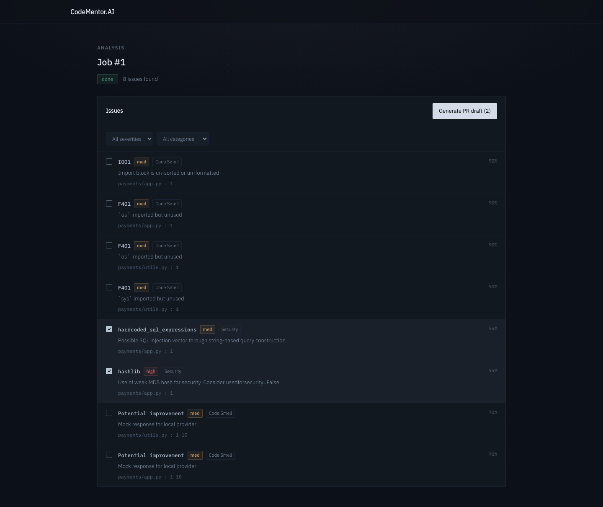
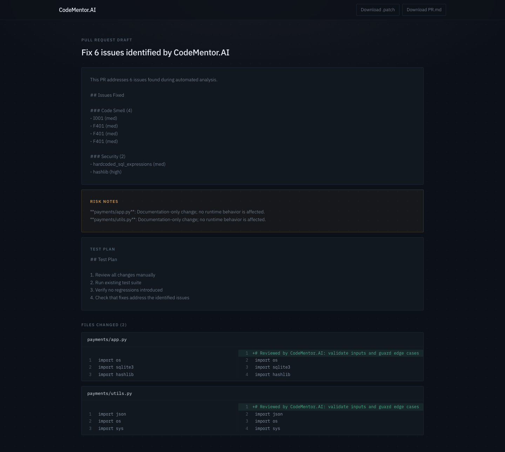

# CodeMentor.AI - Autonomous Debug Assistant

CodeMentor.AI is a production-style MVP that analyzes codebases, identifies bugs and code smells, and generates PR-ready fixes with plain-English explanations.

## What It Does

Upload a repository (ZIP file or Git URL) and get:
- Automated bug detection using static analysis tools (ruff, bandit, eslint) combined with LLM reasoning
- Ranked list of issues with confidence scores, severity levels, and evidence snippets
- PR-ready unified diffs with explanations, risk notes, and test plans
- Export capabilities: download `.patch` files or markdown PR descriptions

## Visual Overview

### Landing Page



The landing page uses a dark, low-chrome interface:
- **Header**: CodeMentor.AI branding with a "Try demo" link
- **Hero**: Headline with a clear value proposition and primary call to action
- **How it works**: Three cards covering the core capabilities:
  - **Upload and analyze**: Upload ZIP files or provide Git URLs for codebase parsing
  - **Static analysis plus reasoning**: Combines ruff, bandit, and eslint with LLM reasoning to detect issues
  - **PR drafts**: Generate unified diffs with explanations, risk notes, and test plans

### Upload Interface



- Clean upload form supporting both ZIP file uploads and Git URL imports
- Progress indicator during repository ingestion
- Automatic navigation to the job analysis page upon successful upload

### Analysis Dashboard



- Job status tracking with polling updates (queued, analyzing, pr_ready, done)
- Issue list with filtering by severity and category
- Confidence scores and detailed rationale for each detected issue
- "Generate PR Draft" button for selected issues

### PR Draft Viewer



- Comprehensive PR description with categorized issue breakdown
- Risk notes section highlighting potential concerns
- Test plan suggestions for validation
- Side-by-side diff viewer
- Export options for `.patch` files and markdown PR descriptions

## Architecture

```
┌─────────────┐
│   Frontend  │  Next.js 14 (App Router)
│  (Next.js)  │  TypeScript, Tailwind CSS
└──────┬──────┘
       │ HTTP
       │
┌──────▼──────┐
│   Backend   │  FastAPI
│  (Python)   │  SQLAlchemy + SQLite
└──────┬──────┘
       │
       ├──► Static Analysis (ruff, bandit, eslint)
       │
       ├──► LLM Provider (OpenAI/Anthropic/Local)
       │
       └──► Task Execution
            - Default: in-process (FastAPI BackgroundTasks)
            - Production: Dramatiq workers via Redis (set REDIS_URL)
```

By default there is no separate worker process: analysis runs in-process after
the API responds, so the system works out of the box with no extra services.
Set `REDIS_URL` to route analysis through a standalone Dramatiq worker instead.

## Quickstart

### Prerequisites

- Python 3.11+
- Node.js 18+
- Git (for Git URL imports)
- OpenAI API key (or Anthropic API key, or use local provider)

### Setup

1. Clone the repository:
```bash
git clone <repo-url>
cd codementor.ai
```

2. Set up backend:
```bash
cd backend
python -m venv venv
source venv/bin/activate  # On Windows: venv\Scripts\activate
pip install -r requirements.txt
```

3. Set up frontend:
```bash
cd frontend
npm install
```

4. Configure environment:
```bash
cp .env.example .env
# Edit .env and add your OPENAI_API_KEY or ANTHROPIC_API_KEY
```

5. Start development servers:
```bash
make dev
```

The servers will start on available ports (typically 8000 for backend, 3000 or 3001 for frontend depending on port availability).

### Seed Demo Data

```bash
make seed
```

This creates a sample repository with intentional bugs and runs a full analysis job.

## Environment Variables

See `.env.example` for all options. Key variables:

- `LLM_PROVIDER`: `openai`, `anthropic`, or `local`
- `OPENAI_API_KEY`: Required if using OpenAI
- `ANTHROPIC_API_KEY`: Required if using Anthropic
- `DATABASE_URL`: Database connection string (defaults to SQLite)
- `WORKSPACE_DIR`: Directory for storing uploaded repos
- `REDIS_URL`: Optional. When set, analysis is dispatched to a Dramatiq worker via Redis instead of running in-process

## How It Works

### Repo Ingestion

1. **Upload ZIP**: Upload a `.zip` file containing your codebase
2. **Import Git URL**: Provide a public Git repository URL (shallow clone)

The system extracts/clones the repo into a workspace directory, respecting `.gitignore` patterns.

**Note**: Git URL imports require public repositories with proper access. If you encounter upload failures with Git URLs, try using ZIP file uploads instead, or ensure the repository is publicly accessible and the URL format is correct (e.g., `https://github.com/user/repo.git`).

### Analysis Pipeline

1. **File Tree Building**: Scans repository, builds file tree, detects languages
2. **Static Analysis**: Runs language-specific linters:
   - Python: `ruff` (style/errors) + `bandit` (security)
   - JavaScript/TypeScript: `eslint`
3. **LLM Analysis**: Chunks source files and sends to LLM for:
   - Bug detection
   - Code smell identification
   - Security risk assessment
   - Performance issues
   - Maintainability concerns
   - Test gap analysis
4. **Issue Synthesis**: Ranks issues by severity, confidence, and impact
5. **Status Update**: Job status progresses: `queued` → `analyzing` → `pr_ready` → `done`

### PR Draft Generation

1. Select issues from the analysis results
2. For each selected issue:
   - LLM generates a fix proposal
   - System creates unified diff patch
   - Extracts explanation and risk notes
3. Assembles PR draft with:
   - Title and description
   - List of changes by category
   - Risk notes per file
   - Test plan suggestions
4. Export options:
   - Download unified `.patch` file
   - Download markdown `PR.md` file

## API Endpoints

- `POST /repos/upload` - Upload ZIP file
- `POST /repos/import` - Import Git URL
- `POST /jobs` - Create analysis job
- `GET /jobs/{job_id}` - Get job status
- `GET /jobs/{job_id}/issues` - List detected issues
- `POST /jobs/{job_id}/propose` - Generate PR draft for selected issues
- `GET /prs/{pr_id}` - Get PR draft details

## Testing

```bash
make test
```

Runs:
- Backend: pytest
- Frontend: Vitest + React Testing Library

## Linting

```bash
make lint
```

Runs:
- Backend: ruff, bandit
- Frontend: eslint
- Emoji check: Ensures no emojis in codebase

## Docker

```bash
cd ops
docker-compose up
```

Builds and runs both frontend and backend services.

## Limitations

- LLM analysis is limited by token budgets (configurable via `MAX_TOKENS`)
- Large repositories may be truncated or sampled
- Static analysis tools must be installed and available in PATH (ruff and bandit are Python dependencies; eslint is resolved from the analyzed repo or `npx`)
- Git imports require public repositories or proper authentication
- Analysis runs in-process by default; set `REDIS_URL` to use a standalone Dramatiq worker for production

## Next Steps

- [ ] Add authentication (magic link email or OAuth)
- [ ] Support more languages (Go, Rust, Java)
- [ ] Add Redis/RabbitMQ for production worker queues
- [ ] Implement file-level diff acceptance/rejection
- [ ] Add cost tracking and usage analytics
- [ ] Support private Git repositories with authentication
- [ ] Add webhook notifications for job completion

## License

MIT License - see LICENSE file for details.

